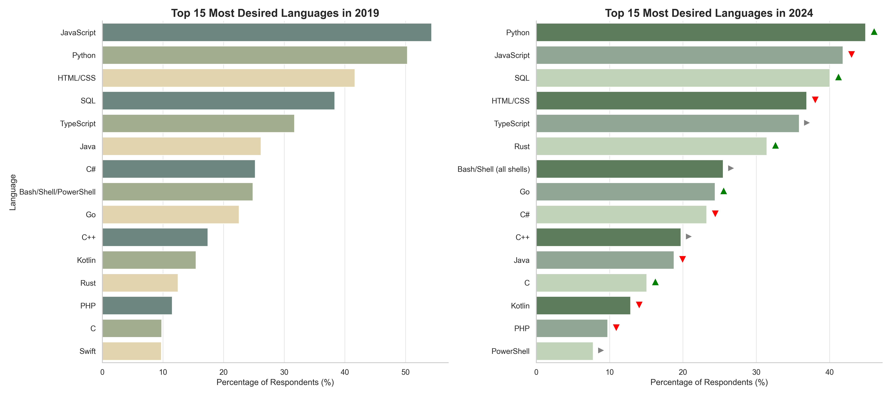
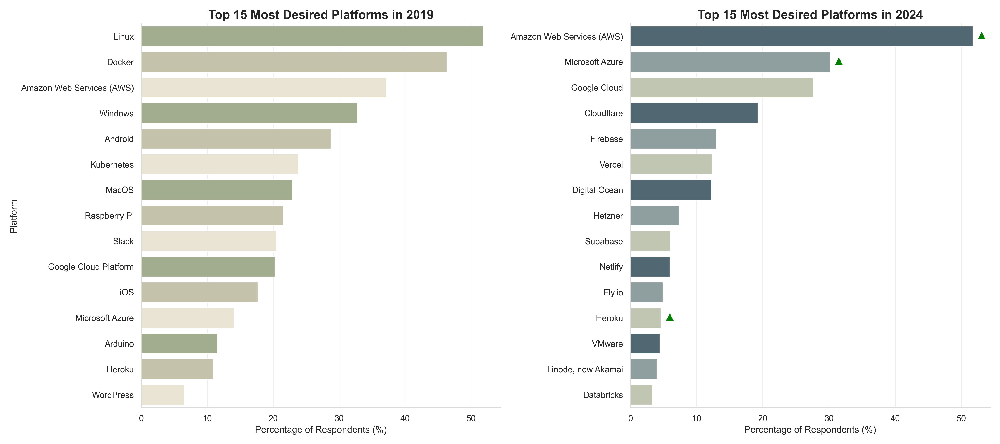
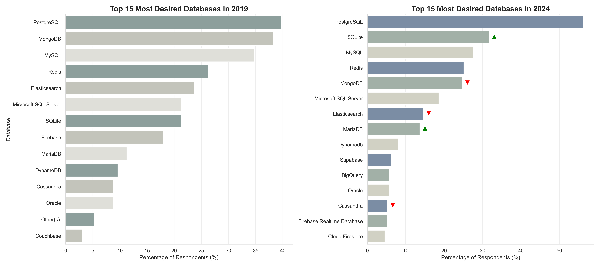
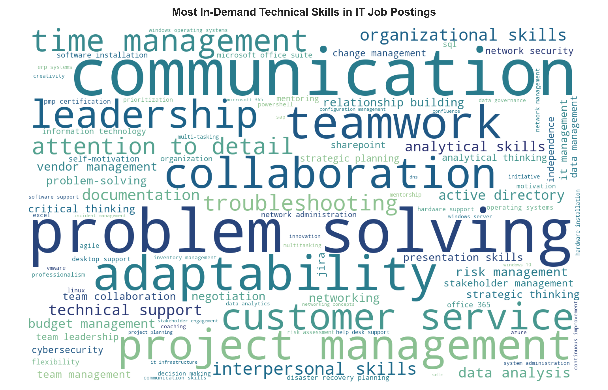
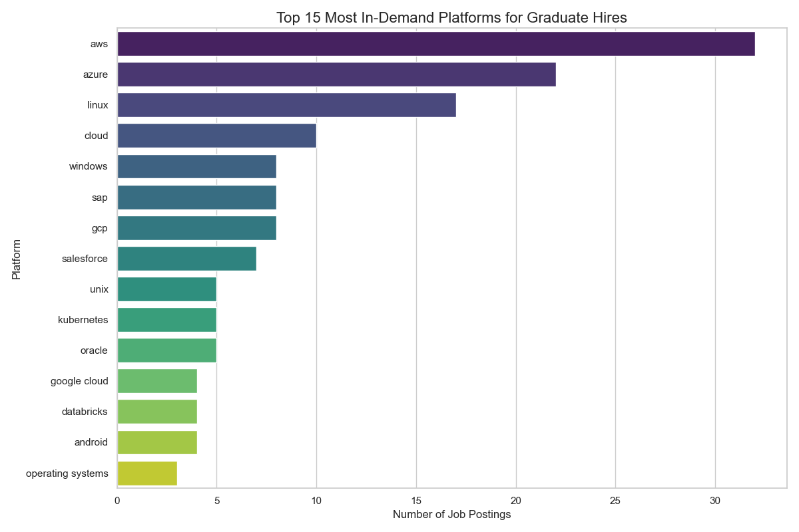
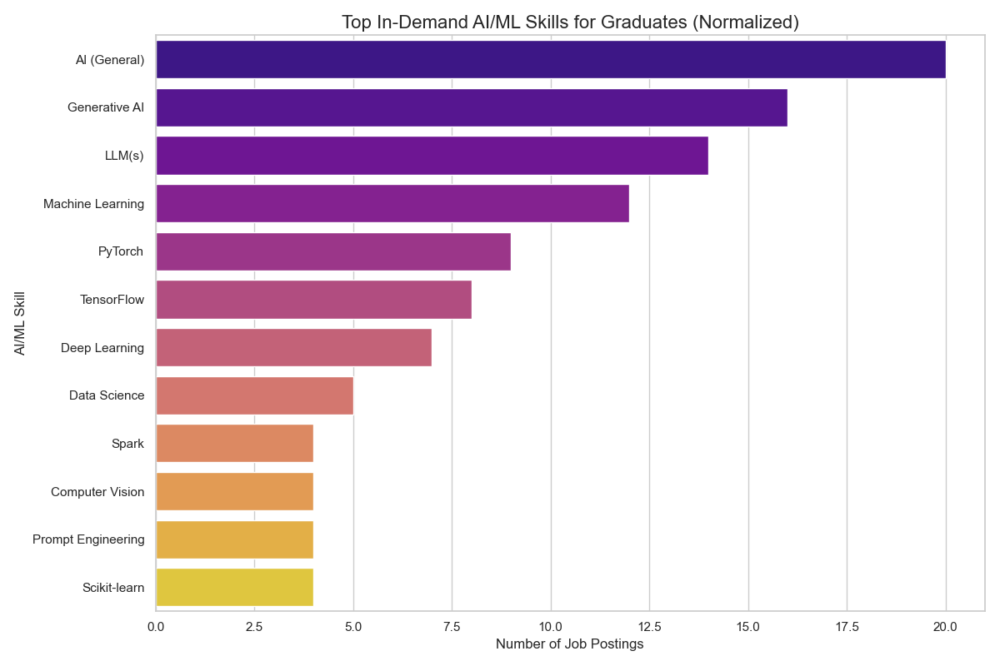

# The Evolving Tech Talent Market
TThis case study examines how developer aspirations, employer needs, and graduate hiring have transformed between 2019 and 2024. By analyzing Stack Overflow surveys, LinkedIn job postings, and college placement data, we track the shift from JavaScript/web-focused skills in 2019 to Python/AI/cloud dominance in 2024.

**Why 2019 vs. 2024?**

- 2019 represents the pre-pandemic baseline - a stable, cloud-first era where AI remained a specialized field

- 2024 reflects the post-AI boom landscape - fundamentally reshaped by remote work adoption and the generative AI revolution that began in 2022

Datasets Utilised:
1. StackOveflow Developer Survey (2019 and 2024)
2. LinkedIn Job Listings(2023-2024)
3. College Placement Data (2025)
The objective is simple: **to uncover where the market is truly moving, not just what it’s talking about.**
## 1. Supply-Side Analysis — The Evolving Developer Profile

This section checks for the transformation of developer “supply”, what skills developers are actively learning, wanting to use.

### 1.1.  Programming Language Landscape — The Rise of Python and the New Performance Stack
In 2019, JavaScript symbolized the web era where developers optimized for browsers and user interactivity. By 2024, Python has overtaken JavaScript as the most-desired language worldwide, indicating a skill-economy change.

- Why Python rose: It anchors AI/ML, data science, and automation.

- Complementary trend: Rust and Go surged as high-performance, type-safe systems languages.

A clear bifurcation in developer priorities:
- Intelligence Track: Python → AI, analytics, automation
- Performance Track: Rust / Go → systems, edge, reliability

As workloads grow data-intensive and distributed, developers are optimizing for both intel (Python) and throughput (Rust/Go), a dual focus defining modern skill portfolios.

### 1.2. Platform Revolution — A Cloud-Native-First Mandate

The 2019 landscape was hybrid: Linux, Windows, and Docker coexisted across on-prem and virtual setups.
By 2024, developers overwhelmingly aspire to build and scale on public clouds, marking a complete architectural inversion.

- Dominant players: AWS, Azure, and GCP now top preference charts.
- Emerging platforms: Vercel, Cloudflare, and Firebase → edge and serverless enovironments.

New baseline: Infrastructure-as-Code, CI/CD pipelines, and container orchestration literacy.

This shift toward cloud-centricity also influences how and where data lives.The need for robust and open data systems becomes important which leads to the database story.

### 1.3. Database Dynamics — The Open-Source Usage

Unlike languages or platforms, databases evolved steadily but strategically. PostgreSQL has strengthened its lead as the preferred open-source standard, outpacing NoSQL challengers.

- Preferred attributes: Performance, scalability, and freedom aligning with the cloud-native mindset.

- Supporting shift: SQLite and MariaDB → lightweight, embeddable solutions for microservice architectures.

Takeaway is developers favor transparent, portable data systems that integrate seamlessly into modular deployments.

The database choice now mirrors the same principles guiding cloud design which is openness, interoperability, and control.

### 1.4 The Shift — The Modern Developer’s DNA
By 2024, the typical developer’s toolkit merged around three interlocking pillars:
| Layer | Core Technologies | Function |
|-------|-------------------|----------|
| Language | Python / SQL | AI and data intelligence |
| Platform | AWS / Azure / GCP | Cloud-native deployment |
| Database | PostgreSQL | Open-source data foundation |

Organizations that fail to mirror this evolution internally will struggle to attract or retain top developers. Talent now expects environments aligned with AI, automation, and distributed systems.

**The modern developer is AI-fluent, cloud-native, and open-source-driven which is a strategic decision for the future of software.**

## 2. Demand-Side Analysis — What the Market Is Hiring For

While Section 1 mapped how the supply of developer talent evolved toward an AI-first, cloud-native identity, this section flips the lens:
**What is the market actually hiring for?**

### 2.1 The Human Core of Technical Work — Soft Skills Take Center Stage

The 2024 IT job skill word cloud reveals a striking trend: the most mentioned "technical" skills aren't programming languages, they're human skills.

- **Dominant terms:** communication, problem-solving, teamwork, adaptability, leadership.

- **Implication:** As automation handles execution, human meta-skills become key differentiators.

- **Shift in expectation:** Employers are not hiring "coders," but collaborators who can coordinate across multi-disciplinary teams.

The human layer is now a critical part of the "technical stack."
The modern technologist's value lies not just in syntax mastery, but in systems thinking, the ability to integrate technology, people, and purpose.

### 2.2 Data Roles — Where Intelligence Meets Infrastructure

Within technical hiring, data roles showcase the most distinct evolution — blending analytics with infrastructure.
The 2024 treemap visualizes how demand consolidates around integrated skill clusters.

#### 2.2.1 Languages: The Trinity
- Python (79.3%) → AI, ML, automation
- SQL (59.5%) → Data querying & pipelines
- R/Go/C++ → Analytics to production bridge

#### 2.2.2 Databases: The Rise of the Cloud Stack
- PostgreSQL (52.4%) → Open-source analytics backbone
- SQLite, SQL Server → Embedded & enterprise use
- Databricks, BigQuery, Snowflake → Cloud-scale analytics

These platforms operate at the junction of data engineering, AI, and real-time analytics, defining the **"Cloud Stack."**

The language layer (Python, SQL) and data infrastructure (PostgreSQL, Snowflake, BigQuery) are converging and Employers want engineers who utilise intelligence, not just explore data.

### 2.3 Closing the Loop 
**Alignment:**
- Python dominates both learning and hiring
- Cloud platforms (AWS, Azure, GCP) lead preferences and demand  
- PostgreSQL bridges open-source learning and real-world use

**Gap:**
- Developers focus on technical depth (AI, performance)
- Employers prioritize delivery and adaptability

**Insight:** Supply builds intelligence; demand delivers it.
## 3. Graduate Hiring and Valuation (Reality Lens)

While developer aspirations and employer demand lean toward AI, automation, and cloud-native skills, the graduate hiring market exposes the reality: where organizations are truly investing money, and how much they value each stack.

### 3.1 The Market's Investment Map

| Stack | Focus | Market Behavior |
|-------|-------|-----------------|
| Systems | C/C++, Linux, Infrastructure | Highest salaries, low supply |
| Enterprise | Java, C#, ERP Systems | High volume, stable pay |
| Data/AI | Python, SQL, ML tools | Fast growth, lower entry salaries |

**Interpretation:** Market pays for reliability (Systems), scale (Enterprise), and cautiously funds innovation (Data/AI).

### 3.2 Key Trends

- **Python**: High demand, lower pay - entry ticket for AI
- **Java/C++**: Higher value for performance roles  
- **Cloud**: Now baseline expectation, not differentiator

### 3.3 AI Reality Check

- High visibility in job posts, limited actual hiring
- Roles often bundled under broader data categories

### 3.4 Compensation Reality

| Stack | Median CTC | Value Driver |
|-------|------------|--------------|
| Systems | 18.5 LPA | Scarcity + reliability |
| Enterprise | 15.4 LPA | Scale + stability |
| Data/AI | 12.0 LPA | Innovation potential |

**Insight:** Market pays for scarcity, not hype.

### 3.5 Forward Outlook

- **AI**: Growth story, not yet profit story
- **Systems**: Critical infrastructure backbone  
- **Enterprise**: Stable modernization bridge

**Final Takeaway:** Current market trains for AI future; next cycle will reward those combining Python, Cloud, and Systems fluency.

### Reflection: Learning, Uncertainty, and Next Steps

As the analysis progressed, one clear realization emerged — the hype curve and the value curve don’t move in sync.
AI and data skills dominate aspiration and discourse, but the compensation and hiring volumes still favor stability and performance (Systems and Enterprise roles).

_#### Uncertainties:_

_The 2024 job dataset may not fully represent small or regional firms, which could understate non-cloud or hybrid tech roles._

_Salary data might be biased by limited samples in high-paying subdomains._

_Next Steps:_
- _With access to multi-year hiring data and cross-industry employer breakdowns, the analysis could model how skill demand migrates over time._
- _Additionally, applying correlation or regression analysis could help quantify how specific skills (e.g., Python + Cloud) influence compensation directly._